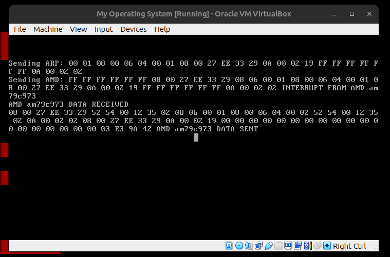
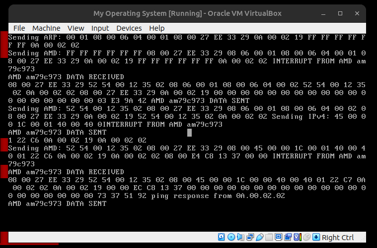
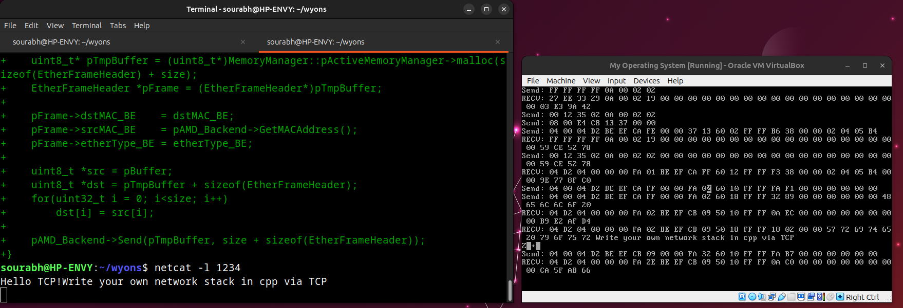
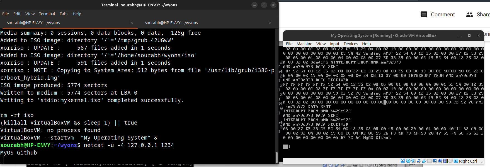
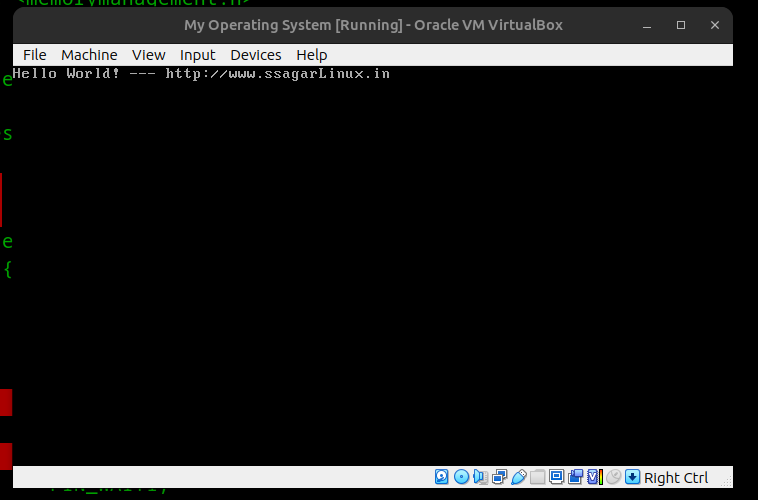
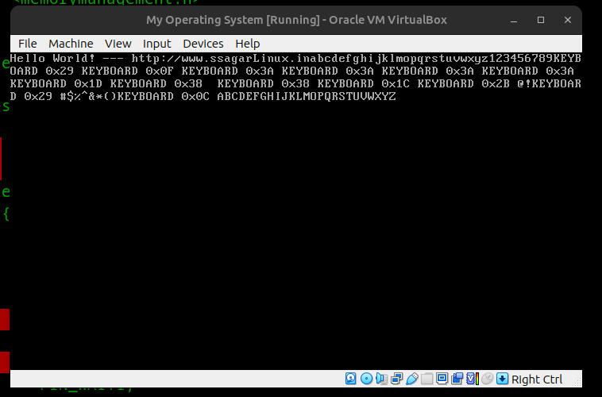
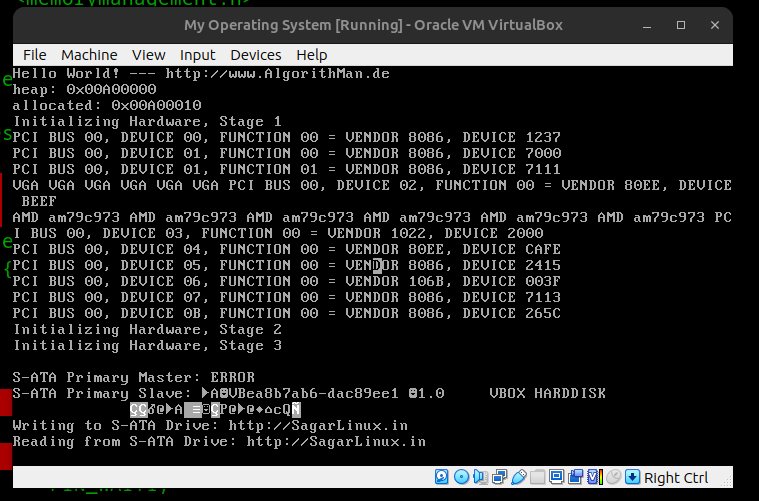
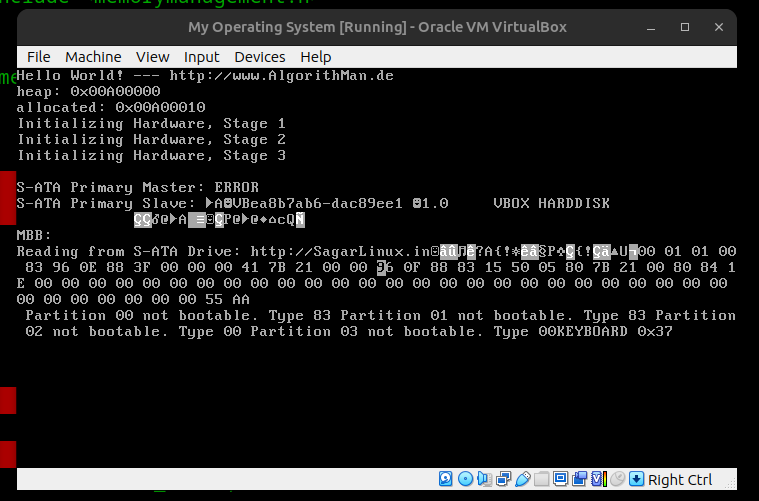
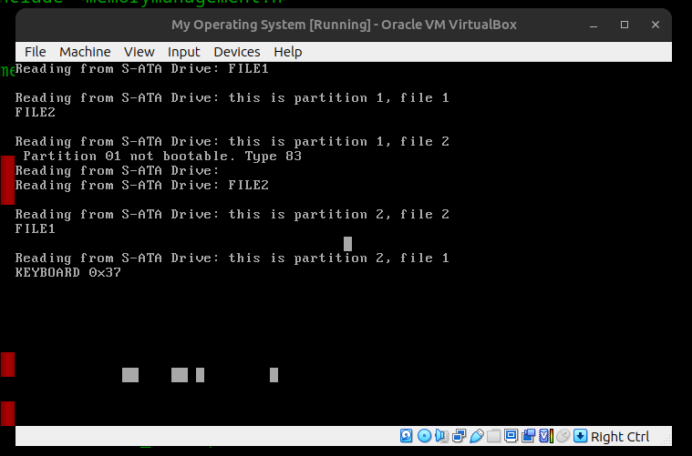

# ssagarWyoos
Write your own Operating System in cpp

## Features till now:
```
loader
linker
kernel compiling
interrupts handling
keyboard handling
mouse handling
PCI mapping
System call
FAT32 fs
```

To start start from here, you'll need the tool kit for OS development, run:
```
sudo apt-get install build-essential nasm genisoimage bochs bochs-sdl
```

To quickly run system use VirtualBox.
So to start it, you should run:
```
make run
```
and to erase not essential files:
```
make clean
```

**TODO**
```
  Network Driver
  TCP/IP Stack
     Ethernet
     ARP
     UDP
     TCP
```


**Since it is open source, you can help the project and make pull requests!**


References:

[Little Book of OS](https://littleosbook.github.io/)
[FS res](https://www.pjrc.com/tech/8051/ide/fat32.html)
[Little Book Of OS  GITHUB](https://littleosbook.github.io/#virtual-machine)

**DEMO:-**

```
Write your own Network Stack in cpp
Adrress Resolution Protocol (ARP)
```


```
Internet Control Message Protocol (ICMP) over IPv4
```


```
Transmission Control Protocol (TCP)
```


```
User Datagram protocol (UDP)
```



```
Write your own Operating System in cpp
Video Graphics Array (VGA)
```


```
Keyboard Driver
```


```
ATA (Advanced Technology Attachment) Driver
```


```
Master Boot Record (MBR)
```


```
FileSystemAllocation (FAT32) table
```



